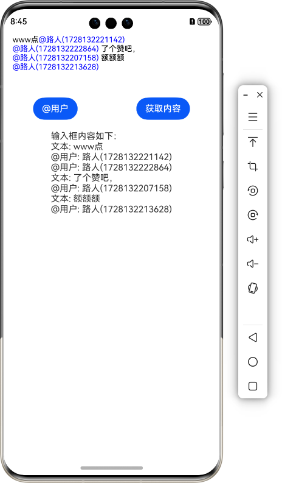

## 💡 简介 

oh-topic-editor: OpenHarmony & HarmonyOS平台上基于RichEditor实现的支持添加话题、@用户的文本编辑组件.  

代码仓库：[oh-topic-editor](https://github.com/sahooz/oh-topic-editor)  

实现思路：https://blog.xinyanruanjian.com/post/13.html

## ⚙️ 下载安装

```shell
ohpm i @xinyansoft/oh-topic-editor
```

OpenHarmony ohpm 环境配置等更多内容，请参考: [下载安装三方库](https://ohpm.openharmony.cn/#/cn/help/downloadandinstall)  

## 🌅 效果图参考



## 📚 接口说明

```typescript
// 用于进行添加@用户、#话题等特殊操作
private controller = new TopicEditorController()
  
TopicEditor({
  controller: this.controller, // 关联的TopicEditorController对象
  doubleDelete: true, // 是否按两次删除才能删除话题、@的用户等，第一次按删除选中待删除的span
  // 为了方便灵活地控制各种样式、设置选项，RichEditor通过BuilderParam传入，由调用者自行创建
  richEditorBuilder: (controller, aboutToDeleteCallback) => {
    this.buildEditor(controller, aboutToDeleteCallback)
  }
})

// 添加#话题、@用户等
this.controller.addTopicSpan({
  id, // 必须保证id唯一，就算多次@同一个用户或者提及同一个话题，id也必须不一样
  builder: () => this.buildAt(id) 
}, offset)
  
@Builder
buildAt(id: string) {
  Text(`@${this.userMap.get(id)} `) // 需要展示的文字、样式，自由控制
    .fontColor(Color.Blue)
    .fontSize(14)
    .id(id) // 这里id必须设置，后续需要根据id找回信息
}

// 获取Editor的最终内容，根据业务逻辑处理成最终结果
let spans = this.controller.getSpans()
let content: string = '输入框内容如下：\n'
for (let span of spans) {
  if(span.isTopicSpan) { // 是自定义的span
    content += `@用户: ${this.userMap.get(span.value)}\n`
  } else { // 是普通文本
    content += `文本: ${span.value}\n`
  }
}
```

## ✍️ 完整使用示例   

```typescript
import { TopicEditor, TopicEditorController } from '@xinyansoft/oh-topic-editor'
import { inputMethod } from '@kit.IMEKit'

@Entry
@Component
struct Index {
  private controller = new TopicEditorController()
  // 记录选择的用户以便后续处理
  private userMap = new Map<string, string>()
  @State private content: string = ''

  build() {
    Column() {
      TopicEditor({
        controller: this.controller,
        doubleDelete: true, // 是否按两次删除才能删除话题、@的用户等，第一次按删除选中待删除的span
        // 为了方便灵活地控制各种样式、设置选项，RichEditor通过BuilderParam传入，由调用者自行创建
        richEditorBuilder: (controller, aboutToDeleteCallback) => {
          this.buildEditor(controller, aboutToDeleteCallback)
        }
      })

      Row() {
        Button('@用户')
          .onClick(() => this.at(this.controller.getRichEditorController().getCaretOffset()))

        Button('获取内容')
          .onClick(() => {
            let spans = this.controller.getSpans()
            let content: string = '输入框内容如下：\n'
            for (let span of spans) {
              if(span.isTopicSpan) {
                content += `@用户: ${this.userMap.get(span.value)}\n`
              } else {
                content += `文本: ${span.value}\n`
              }
            }
            this.content = content
          })
      }.width('100%')
      .justifyContent(FlexAlign.SpaceAround)
      .margin({
        top: 20,
        bottom: 20
      })

      Text(this.content)
    }
    .height('100%')
    .width('100%')
    .onClick(() => {
      inputMethod.getController().stopInputSession()
    })
  }

  private at(offset: number) {
    let id = new Date().getTime().toString()
    this.userMap.set(id, `路人(${id})`)
    this.controller.addTopicSpan({
      id, // 必须保证id唯一，就算多次@同一个用户或者提及同一个话题，id也必须不一样
      builder: () => this.buildAt(id)
    }, offset)
  }

  @Builder
  buildAt(id: string) {
    Text(`@${this.userMap.get(id)} `)
      .fontColor(Color.Blue)
      .fontSize(14)
      .id(id)
  }

  @Builder
  buildEditor(controller: RichEditorController, aboutToDeleteCallback: Callback<RichEditorDeleteValue, boolean>) {
    RichEditor({controller})
      .onReady(() => {
        controller.setTypingStyle({
          fontColor: Color.Black,
          fontSize: 14
        })
      })
      .aboutToDelete(aboutToDeleteCallback) // 出于doubleDelete选项需要
      .onIMEInputComplete((result) => {
        let offset = result.offsetInSpan
        let input = result.value.substring(offset[0], offset[1])
        if(input == '@') { // 这里监听是不是刚刚输入了@，同理可以按需求监听#、$、&等等其他字符
          let atOffset = result.spanPosition.spanRange[0] + offset[0]
          AlertDialog.show({
            title: '模仿选择要@的用户操作',
            message: '确定@用户吗?',
            autoCancel: true,
            alignment: DialogAlignment.Center,
            confirm: {
              value: '确定',
              action: () => {
                controller.deleteSpans({start: atOffset, end: atOffset + 1 })
                this.at(atOffset)
              }
            }
          })
        }
      })
      .borderColor(Color.Red)
      .width('100%')
      .height(100)
  }
}
```

## ⚠️ 局限性及注意事项

只支持TextSpan和TopicSpan，加入其他Span可能会导致未知异常。  
另外，该实现思路未得到生产环境验证。

## 📱 更多

我开发的其他鸿蒙库：  
1. [oh-crop](https://ohpm.openharmony.cn/#/cn/detail/@xinyansoft%2Foh-crop): OpenHarmony/HarmonyOS上的简单的图片剪裁库，可用于头像剪裁等常见场景。  
2. [oh-date-picker](https://ohpm.openharmony.cn/#/cn/detail/@xinyansoft%2Foh-crop): OpenHarmony/HarmonyOS平台日期选择器增强版。  

我的博客：https://blog.xinyanruanjian.com/

我的公众号：程序员吹白  


鸿蒙开发交流QQ群：546723002

## 🌐 开源协议

MIT